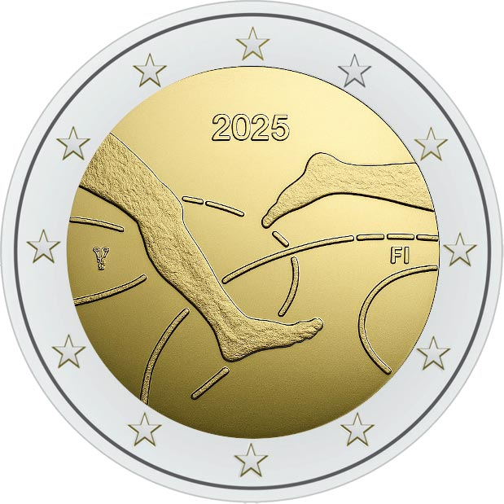

# Finland € 2.00

## Images

## Metadata

**Country:** [Finland](../../Countries/Finland/index.md)\
**Monetary value:** € 2.00\
**Currency:** Euro\
**Issue date:** 2025-08-12\
**Designer:** Pertti Kalervo Mäkinen

## Description

100 Years of the Finnish-Swedish Athletic Games

## Mintages

| Year | Mintmark | Circulated | Brilliant Uncirculated | Proof |
| ---- | -------- | ---------- | ---------------------- | ----- |
| 2025 |          | 0          | 0                      | 0     |
