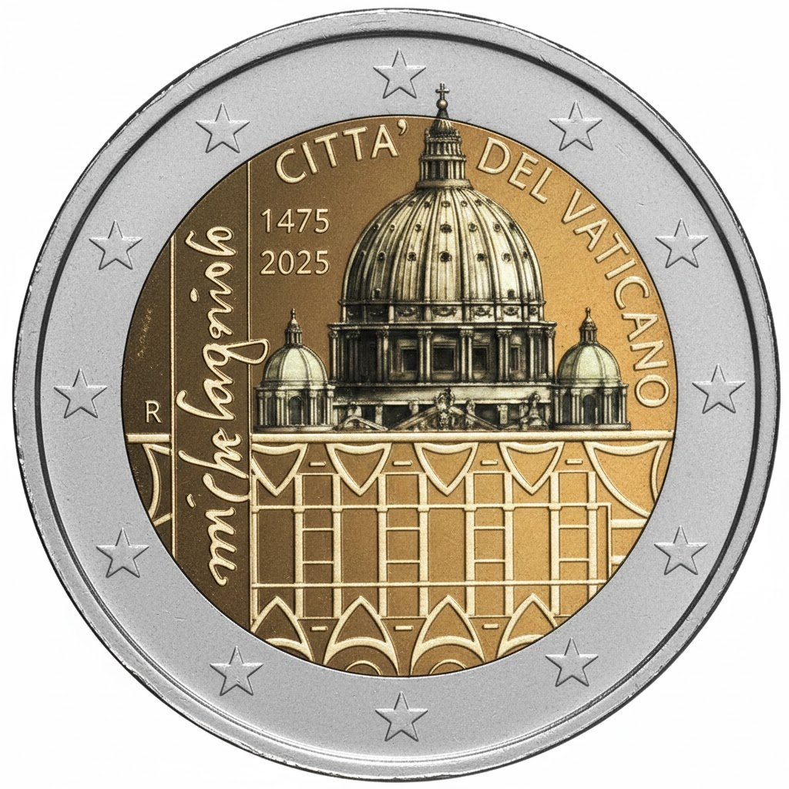

# Vatican € 2.00

## Images

## Metadata

**Country:** [Vatican City](../../Countries/Vatican%20City/index.md)\
**Monetary value:** € 2.00\
**Currency:** Euro\

## Description
550th Anniversary of the Birth of Michelangelo

## Mintages

| Year | Mintmark | Circulated | Brilliant Uncirculated | Proof |
| ---- | -------- | ---------- | ---------------------- | ----- |
| 2025 |          | 0          | 0                      | 0     |
