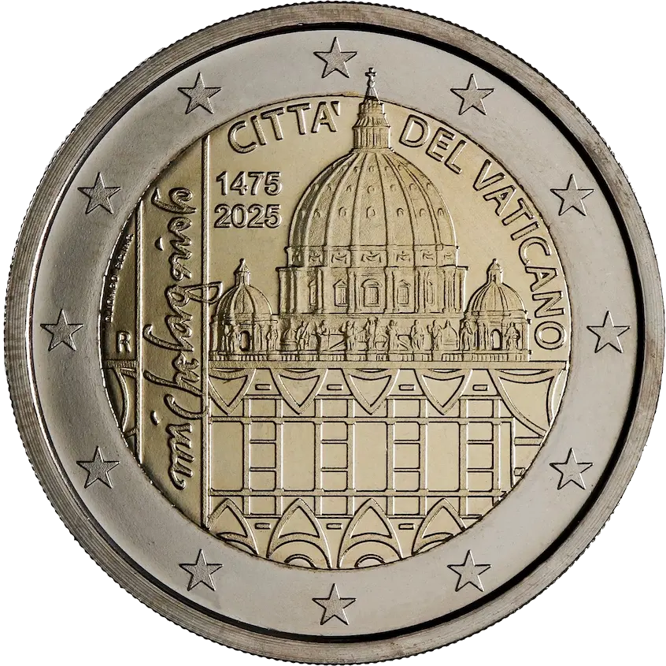

# Vatican € 2.00

## Images

## Metadata

**Country:** [Vatican City](../../Countries/Vatican%20City/index.md)\
**Monetary value:** € 2.00\
**Currency:** Euro\
**Issue date:** 2025-10-27\
**Designer:** Daniela Longo

## Description

550th Anniversary of the Birth of Michelangelo

## Mintages

| Year | Mintmark | Circulated | Brilliant Uncirculated | Proof |
| ---- | -------- | ---------- | ---------------------- | ----- |
| 2025 |          | 0          | 70000                  | 0     |

### Sources

[Issue date](https://www.cfn.va/en/numismatics/1127-2-euro-bu-2025-550th-anniversary-birth-of-michelangelo.html)\
[Designer](https://www.cfn.va/en/numismatics/1127-2-euro-bu-2025-550th-anniversary-birth-of-michelangelo.html)\
[Mintages](https://www.cfn.va/en/numismatics/1127-2-euro-bu-2025-550th-anniversary-birth-of-michelangelo.html)
