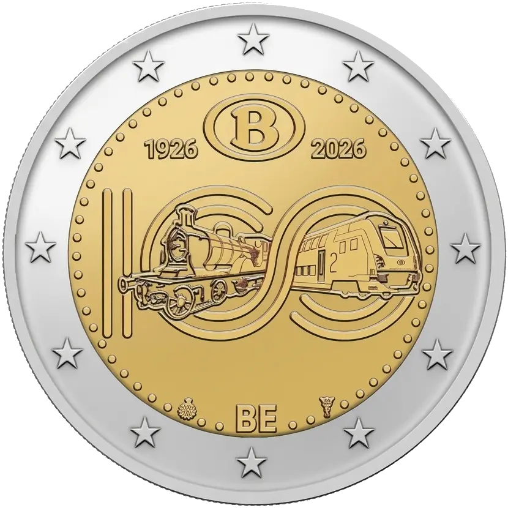

# Belgium € 2.00

## Images

## Metadata

**Country:** [Belgium](../../Countries/Belgium/index.md)\
**Monetary value:** € 2.00\
**Currency:** Euro\
**Issue date:** 2026-06-15\
**Designer:** Iris Bruijns

## Description

100 Years of the SNCB/NMBS (Belgian Federal Railway Company)

## Mintages

| Year | Mintmark | Circulated | Brilliant Uncirculated | Proof |
| ---- | -------- | ---------- | ---------------------- | ----- |
| 2026 |          | 0          | 150000                 | 7000  |

### Sources

- [Mintage BU](https://finance.belgium.be/en/issuances-official-assortment-royal-mint-belgium)\
- [Mintage Proof](https://finance.belgium.be/en/issuances-official-assortment-royal-mint-belgium)
- [Release Date](https://www.instagram.com/p/DZm6W53jWd4/?img_index=1)
- [Designer](https://www.herdenkingsmunten.be/2-euromunt-belgie-2026-100-jaar-nmbs-bu-in-coincard-nl)
