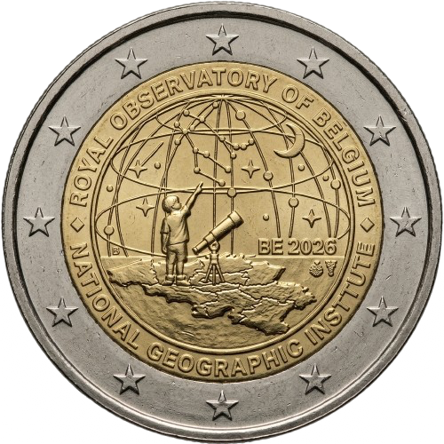

# Belgium € 2.00

## Images

## Metadata

**Country:** [Belgium](../../Countries/Belgium/index.md)\
**Monetary value:** € 2.00\
**Currency:** Euro\
**Issue date:** 2026-09-25\
**Designer:** Iris Bruijns

## Description

50th Anniversary of the Belgian National Geographic Institute and 200th Anniversary of the Royal Observatory of Belgium

## Mintages

| Year | Mintmark | Circulated | Brilliant Uncirculated | Proof |
| ---- | -------- | ---------- | ---------------------- | ----- |
| 2026 |          | 0          | 125000                 | 7000  |

### Sources

- Mintages [BU 1](https://www.herdenkingsmunten.be/2-euromunt-belgie-2026-50-jaar-nationaal-geografisch-instituut-200-jaar-koninklijke-sterrenwacht-van-belgie-bu-in-coincard-nl), [BU 2](https://www.herdenkingsmunten.be/2-euromunt-belgie-2026-50-jaar-nationaal-geografisch-instituut-200-jaar-koninklijke-sterrenwacht-van-belgie-bu-in-coincard-fr)
- Mintages [Proof](https://www.herdenkingsmunten.be/2-euromunt-belgie-2026-50-jaar-nationaal-geografisch-instituut-200-jaar-koninklijke-sterrenwacht-van-belgie-proof-in-etui), [Reverse Proof](https://www.herdenkingsmunten.be/2-euromunt-belgie-2026-50-jaar-nationaal-geografisch-instituut-200-jaar-koninklijke-sterrenwacht-van-belgie-reverse-proof-in-etui)
- [Issue date]()
- [Designer](https://www.herdenkingsmunten.be/2-euromunt-belgie-2026-50-jaar-nationaal-geografisch-instituut-200-jaar-koninklijke-sterrenwacht-van-belgie-bu-in-coincard-nl)
