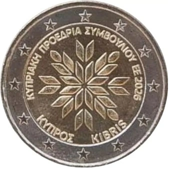

# Cyprus € 2.00

## Images

## Metadata

**Country:** [Cyprus](../../Countries/Cyprus/index.md)\
**Monetary value:** € 2.00\
**Currency:** Euro\
**Issue date:** 2026-05-20\
**Designer:** Marios Kouroufexis

## Description

Presidency of the Council of the European Union

## Mintages

| Year | Mintmark | Circulated | Brilliant Uncirculated | Proof |
| ---- | -------- | ---------- | ---------------------- | ----- |
| 2026 |          | 250000     | 10000                  | 15000  |

### Sources
- [Mintages](https://www.centralbank.cy/en/banknotes-and-coins/commemorative-coins/pictures-and-descr-of-euro-commemorative-coins/commemorative-coin-2%E2%82%AC-assumption-of-the-presidency-of-the-council-of-the-european-union-by-the-republic-of-cyprus)
- [Release Date](https://www.centralbank.cy/images/media/redirectfile/Announcement_Commemorative_coin_2026_MO_%CE%95%CE%9D.pdf)
- [Designer](https://www.centralbank.cy/en/banknotes-and-coins/commemorative-coins/pictures-and-descr-of-euro-commemorative-coins/commemorative-coin-2%E2%82%AC-assumption-of-the-presidency-of-the-council-of-the-european-union-by-the-republic-of-cyprus)
