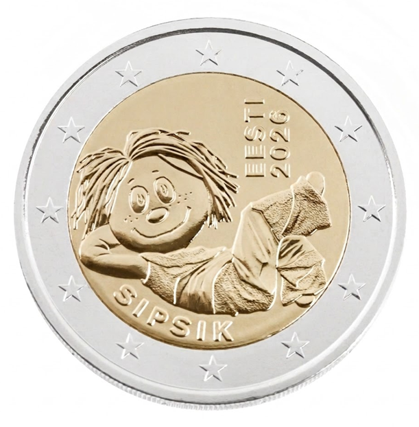

# Estonia € 2.00

## Images

## Metadata

**Country:** [Estonia](../../Countries/Estonia/index.md)\
**Monetary value:** € 2.00\
**Currency:** Euro\
**Issue date:** 2026-06-05\
**Designer:** Vladimir Taiger

## Description

Sipsik, the beloved character of Estonian children's literature

## Mintages

| Year | Mintmark | Circulated | Brilliant Uncirculated | Proof |
| ---- | -------- | ---------- | ---------------------- | ----- |
| 2026 |          | 991500     | 8500                   | 0     |

### Sources

[Design](https://www.eestipank.ee/en/press/eesti-pank-issuing-two-euro-coin-sipsik-14052026)\
[Issue date](https://www.eestipank.ee/en/press/eesti-pank-issuing-two-euro-coin-sipsik-14052026)\
[Designer](https://www.eestipank.ee/en/press/eesti-pank-issuing-two-euro-coin-sipsik-14052026)\
[Mintages Circulated](https://www.eestipank.ee/en/press/eesti-pank-issuing-two-euro-coin-sipsik-14052026)\
[Mintages BU](https://www.eestipank.ee/en/press/eesti-pank-issuing-two-euro-coin-sipsik-14052026)