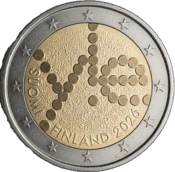

# France € 2.00

## Images

## Metadata

**Country:** [Finland](../../Countries/Finland/index.md)\
**Monetary value:** € 2.00\
**Currency:** Euro\
**Issue date:** 2026-05-21\
**Designer:** Petri Neuvonen

## Description

100 Years of Yle (Finnish National Broadcaster)

## Mintages

| Year | Mintmark | Circulated | Brilliant Uncirculated | Proof |
| ---- | -------- | ---------- | ---------------------- | ----- |
| 2026 |          | 75000      | 100000                 | 5000  |

[Design](https://www.helsinkimint.com/finland-2-euro-100-years-yle-broadcasting-bu-quality-in-coincard-en)\
[Issue date](https://www.helsinkimint.com/blog/yle-100th-anniversary-celebrated-with-2-euro-commemorative-coin.html)\
[Designer](https://www.helsinkimint.com/blog/yle-100th-anniversary-celebrated-with-2-euro-commemorative-coin.html)\