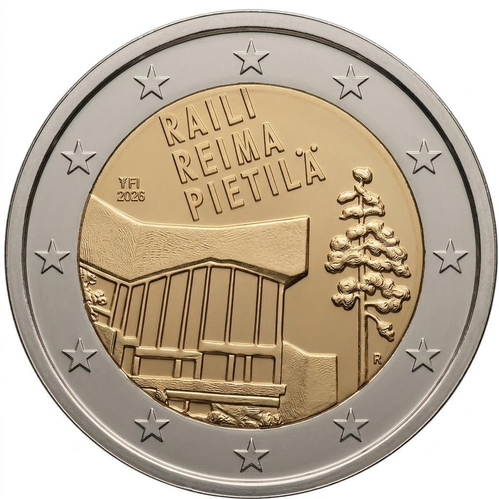

# France € 2.00

## Images

## Metadata

**Country:** [Finland](../../Countries/Finland/index.md)\
**Monetary value:** € 2.00\
**Currency:** Euro\
**Issue date:** 2026-08-26\
**Designer:** Pekka Rytkönen

## Description

Raili and Reima Pietilä

## Mintages

| Year | Mintmark | Circulated | Brilliant Uncirculated | Proof |
| ---- | -------- | ---------- | ---------------------- | ----- |
| 2026 |          | 75000      | 100000                 | 3000  |

### Sources

- Mintages [Circulated](https://www.helsinkimint.com/finland-2-euro-raili-reima-pietila-coin-roll), [BU (1)](https://www.helsinkimint.com/finland-2-euro-raili-reima-pietila-bu-quality-in-coincard-en) and [BU (2)](https://www.helsinkimint.com/finland-2-euro-raili-reima-pietila-bu-quality-in-coincard-fi-se), [Proof](https://www.helsinkimint.com/finland-2-euro-raili-reima-pietila-proof-quality)
- [Issue date](https://www.helsinkimint.com/finland-2-euro-raili-reima-pietila-coin-roll)
- [Designer](https://www.helsinkimint.com/finland-2-euro-raili-reima-pietila-coin-roll)
