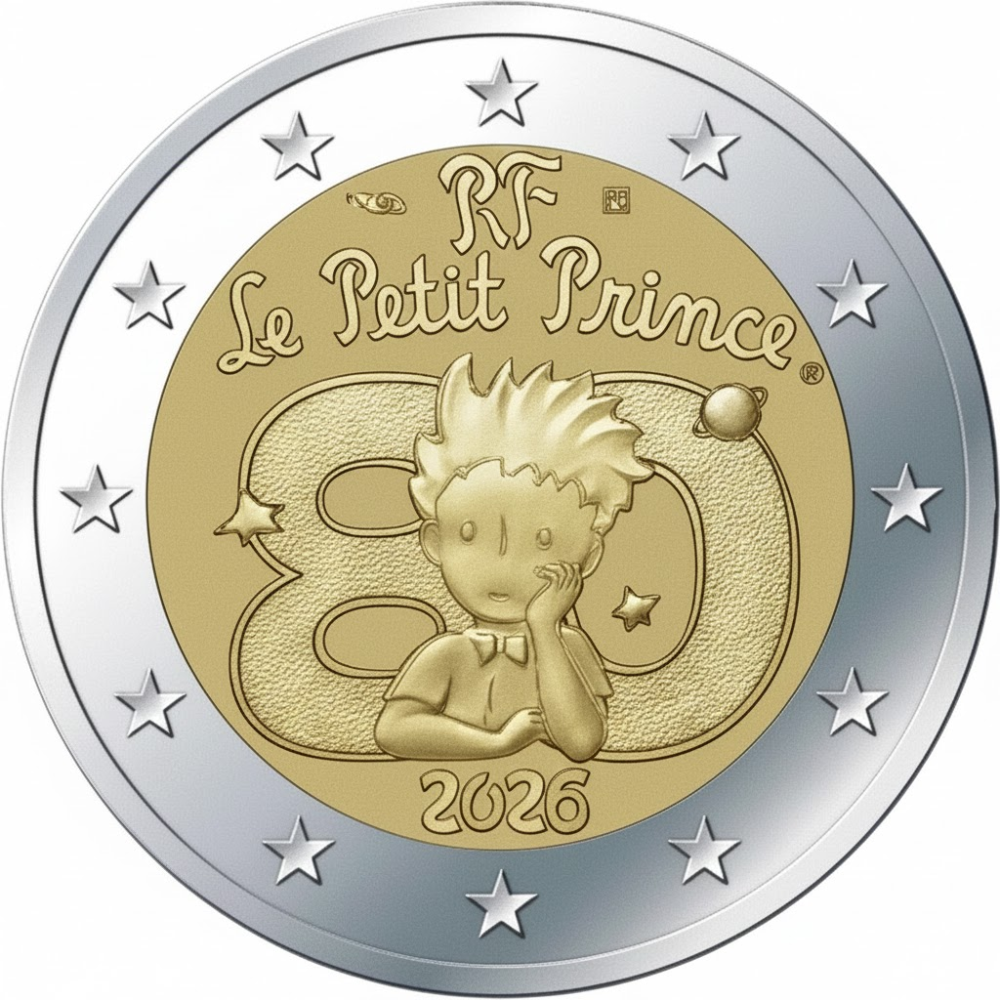

# France € 2.00

## Images

## Metadata

**Country:** [France](../../Countries/France/index.md)\
**Monetary value:** € 2.00\
**Currency:** Euro\
**Issue date:** 2026-01-29

## Description

80th anniversary of the Publication of The Little Prince

## Mintages

| Year | Mintmark | Circulated | Brilliant Uncirculated | Proof |
| ---- | -------- | ---------- | ---------------------- | ----- |
| 2026 |          | 0          | 0                      | 0     |
