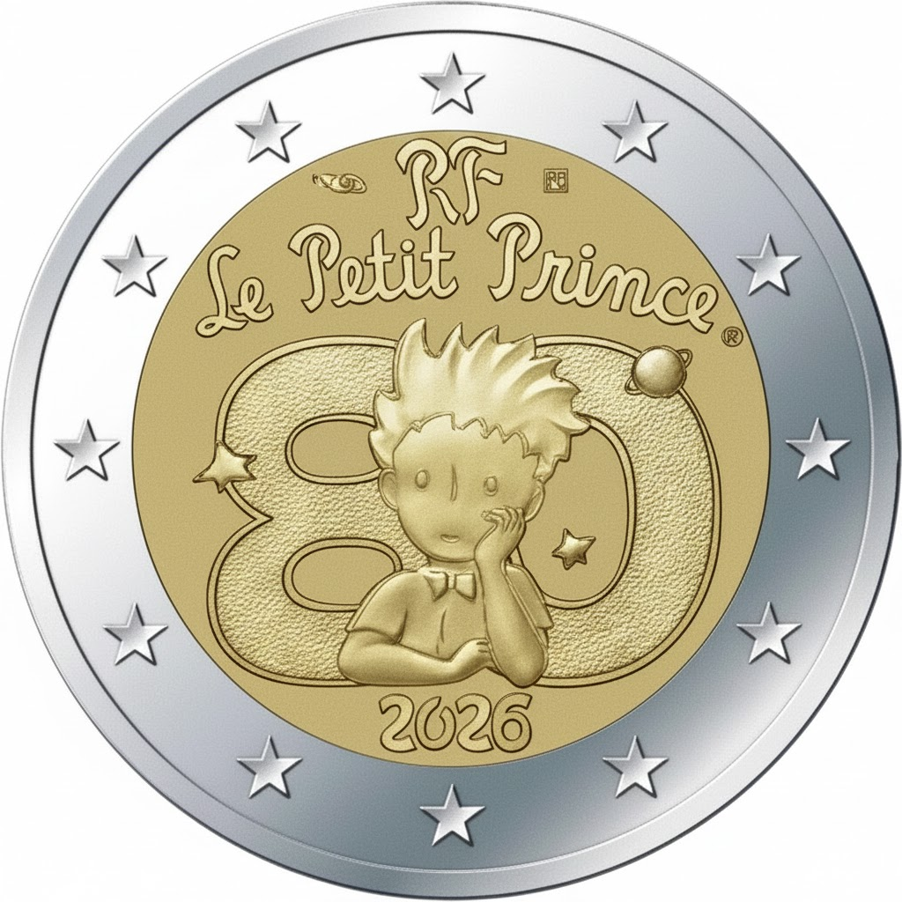

# France € 2.00

## Images

## Metadata

**Country:** [France](../../Countries/France/index.md)\
**Monetary value:** € 2.00\
**Currency:** Euro\
**Issue date:** 2026-01-29\
**Designer:**

## Description

80th anniversary of the Publication of The Little Prince

## Mintages

| Year | Mintmark | Circulated | Brilliant Uncirculated | Proof |
| ---- | -------- | ---------- | ---------------------- | ----- |
| 2026 |          | 0          | 300000                 | 30000 |

### Sources

- [Mintage BU](https://www.monnaiedeparis.fr/en/the-little-prince-the-book-2eur-commemorative-coin-brilliant-uncirculated-quality-yeardate-2026)
- [Mintage Proof](https://www.monnaiedeparis.fr/en/the-little-prince-2eur-commemorative-coin-proof-quality-yeardate-2026)
- [Release Date](https://www.monnaiedeparis.fr/en/agenda-monetaire?agenda_mon_t_ag_mon_date=2026)
