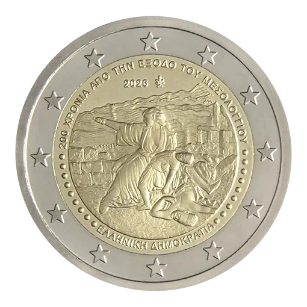

# Greece € 2.00

## Images

## Metadata

**Country:** [Greece](../../Countries/Greece/index.md)\
**Monetary value:** € 2.00\
**Currency:** Euro\
**Issue date:** 2026-09-15\
**Designer:** Georgios Stamatopoulos

## Description

200 years since the Exodus of Missolonghi

## Mintages

| Year | Mintmark | Circulated | Brilliant Uncirculated | Proof |
| ---- | -------- | ---------- | ---------------------- | ----- |
| 2026 |          | 740500     | 6000                   | 3500  |

### Sources

- [Mintages Circulated](https://mint.bankofgreece.gr/en/coins/2026/circulation-200-years-from-the-exodus-of-messolonghi/)
- [Mintages BU](https://mint.bankofgreece.gr/en/coins/2026/blister-200-years-from-the-exodus-of-messolonghi/)
- [Mintages Proof](https://mint.bankofgreece.gr/en/coins/2026/proof-200-years-from-the-exodus-of-messolonghi/)
- [Release Date](https://www.bankofgreece.gr/RelatedDocuments/New_EditionsEN.docx)
- [Designer](https://mint.bankofgreece.gr/en/coins/2026/circulation-200-years-from-the-exodus-of-messolonghi/)
