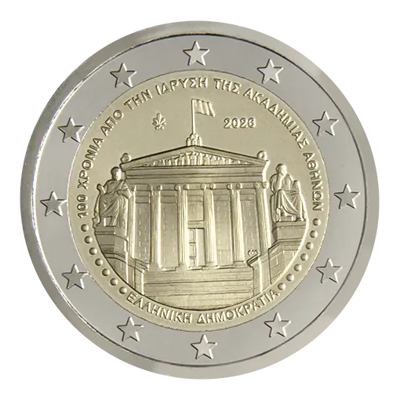

# Greece € 2.00

## Images

## Metadata

**Country:** [Greece](../../Countries/Greece/index.md)\
**Monetary value:** € 2.00\
**Currency:** Euro\
**Issue date:** 2026-06-15\
**Designer:** Georgios Stamatopoulos

## Description

100th Anniversary of the Founding of the modern Academy of Athens

## Mintages

| Year | Mintmark | Circulated | Brilliant Uncirculated | Proof |
| ---- | -------- | ---------- | ---------------------- | ----- |
| 2026 |          | 740500.    | 6000                   | 3500  |

### Sources

[Issue Date](https://mint.bankofgreece.gr/en/coins/2026/circulation-100-years-from-the-foundation-of-the-academy-of-athens/)
[Designer](https://mint.bankofgreece.gr/en/coins/2026/blister-100-years-from-the-foundation-of-the-academy-of-athens/)\
[Source Circulated](https://mint.bankofgreece.gr/en/coins/2026/circulation-100-years-from-the-foundation-of-the-academy-of-athens/)
[Source BU](https://mint.bankofgreece.gr/en/coins/2026/blister-100-years-from-the-foundation-of-the-academy-of-athens)\
[Source Proof](https://mint.bankofgreece.gr/en/coins/2026/proof-100-years-from-the-foundation-of-the-academy-of-athens/)