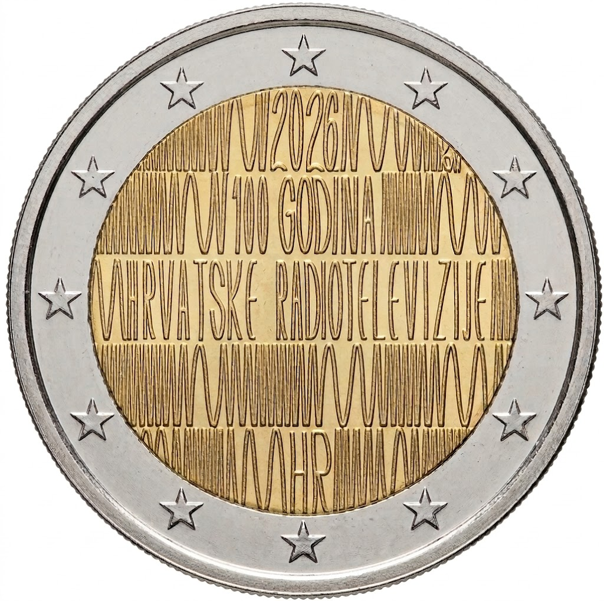

# Croatia € 2.00

## Images

## Metadata

**Country:** [Croatia](../../Countries/Croatia/index.md)\
**Monetary value:** € 2.00\
**Currency:** Euro\
**Issue date:** 2026-07-16\
**Designer:** Karlo Grass

## Description

100 Years of Croatian Radio

## Mintages

| Year | Mintmark | Circulated | Brilliant Uncirculated | Proof |
| ---- | -------- | ---------- | ---------------------- | ----- |
| 2026 |          | 190000     | 5000                   | 5000  |

### Sources

- [Mintages Circulated](https://www.hnb.hr/en/-/hnb-izdaje-prigodnu-optjecajnu-kovanicu-od-2-eura-100-godina-hrvatske-radiotelevizije)
- [Issue Date](https://www.hnb.hr/en/-/hnb-izdaje-prigodnu-optjecajnu-kovanicu-od-2-eura-100-godina-hrvatske-radiotelevizije)
- [Designer](https://www.hnb.hr/en/-/hnb-izdaje-prigodnu-optjecajnu-kovanicu-od-2-eura-100-godina-hrvatske-radiotelevizije)
- [Design](https://www.hnb.hr/en/-/hnb-izdaje-prigodnu-optjecajnu-kovanicu-od-2-eura-100-godina-hrvatske-radiotelevizije)
