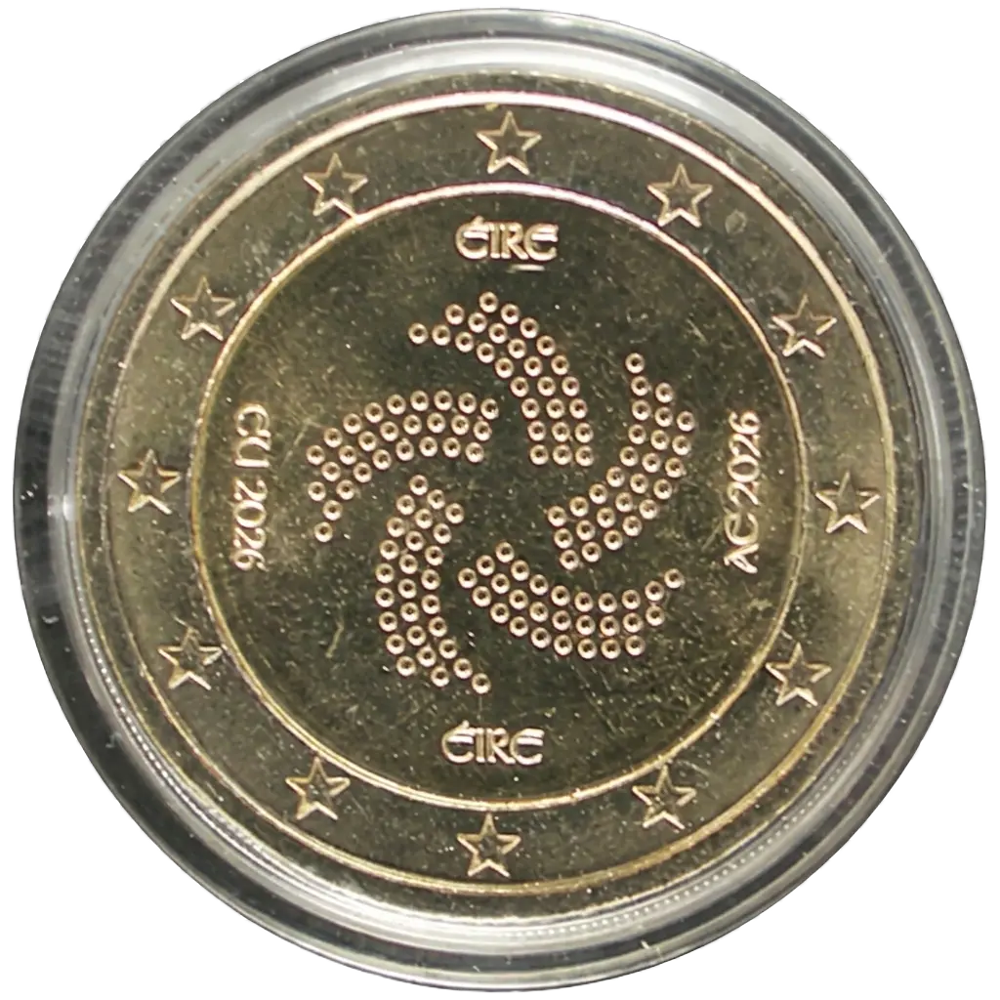

# Ireland € 2.00

## Images

## Metadata

**Country:** [Ireland](../../Countries/Ireland/index.md)\
**Monetary value:** € 2.00\
**Currency:** Euro\
**Issue date:** 2026-07-07\
**Designer:**

## Description

Irish Presidency of the Council of the European Union

## Mintages

| Year | Mintmark | Circulated | Brilliant Uncirculated | Proof |
| ---- | -------- | ---------- | ---------------------- | ----- |
| 2026 |          | 500000     | 0                      | 1000  |

### Sources

- [Mintage Circulated](https://www.centralbank.ie/news/article/press-release-central-bank-launches-2-commemorative-coin-to-mark-irish-presidency-of-the-council-of-the-european-union-6-july-2026)
- [Mintage Proof]()
- [Issue Date](https://www.centralbank.ie/news/article/press-release-central-bank-launches-2-commemorative-coin-to-mark-irish-presidency-of-the-council-of-the-european-union-6-july-2026)
- [Designer]()
