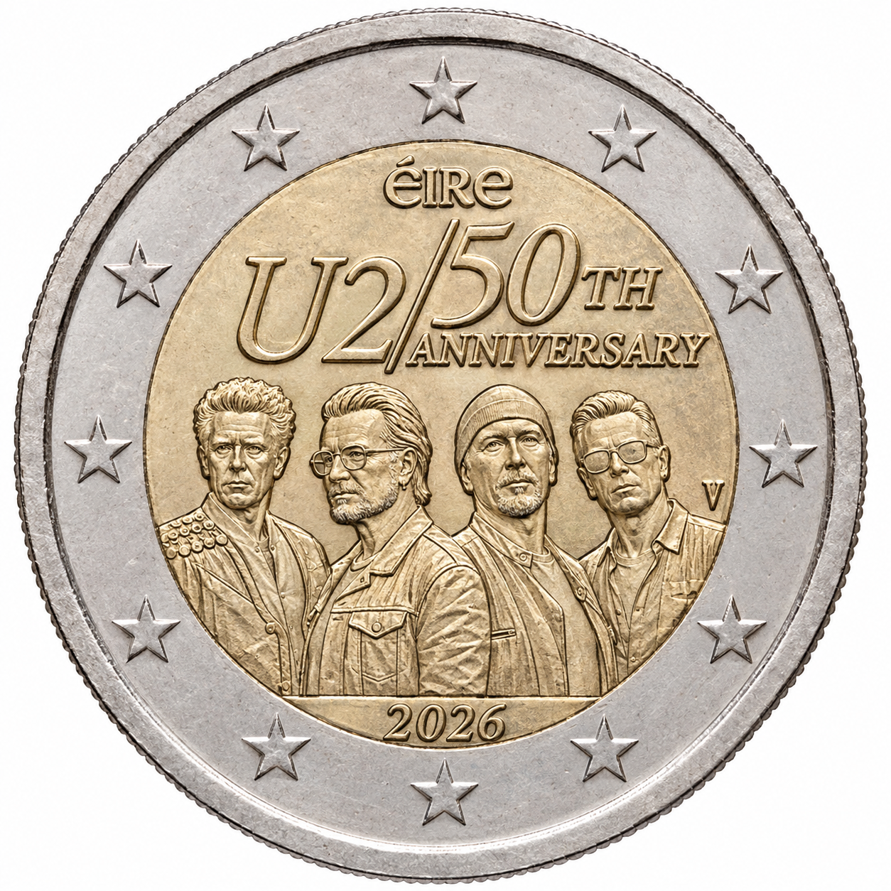

# Ireland € 2.00

## Images

## Metadata

**Country:** [Ireland](../../Countries/Ireland/index.md)\
**Monetary value:** € 2.00\
**Currency:** Euro\
**Issue date:** 2026-09-25\
**Designer:** Shaughn McGrath

## Description

50 years since the formation of U2

## Mintages

| Year | Mintmark | Circulated | Brilliant Uncirculated | Proof |
| ---- | -------- | ---------- | ---------------------- | ----- |
| 2026 |          | 0          | 150000                 | 5000  |

### Sources

- [Mintage BU](https://www.collectorcoins.ie/2-euro-coin-u2-50th-anniversary-2026-bu-quality-in-coincard)
- [Mintage Proof](https://www.collectorcoins.ie/2-euro-proof-coin-u2-50th-anniversary-2026)
- [Issue Date](https://www.collectorcoins.ie/two-remarkable-irish-commemorative-coins-are-on-their-way)
- [Designer](https://www.collectorcoins.ie/2-euro-coin-u2-50th-anniversary-2026-bu-quality-in-coincard)
