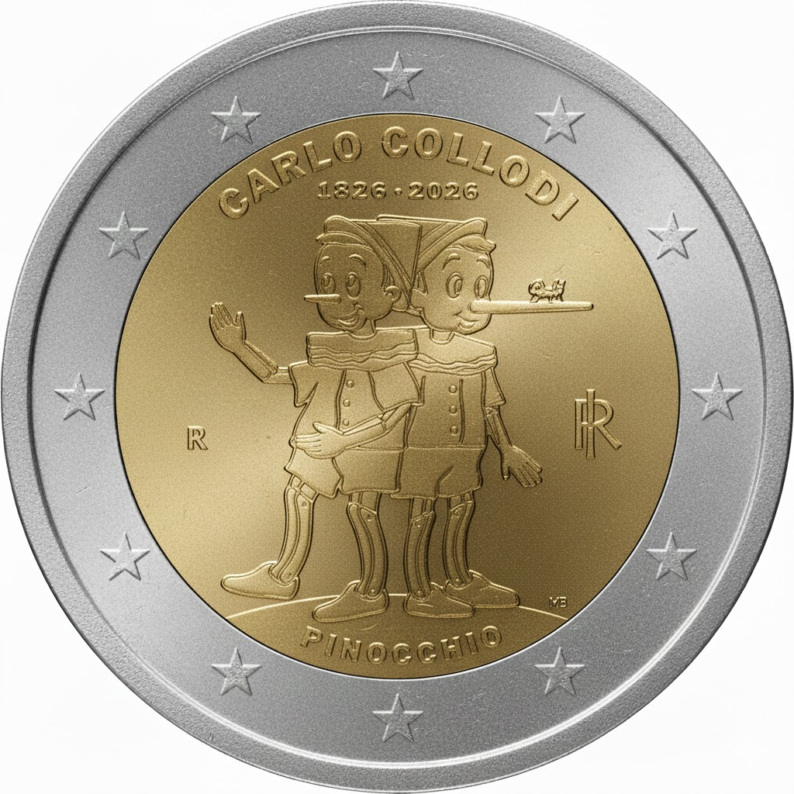

# Italy € 2.00

## Images

## Metadata

**Country:** [Italy](../../Countries/Italy/index.md)\
**Monetary value:** € 2.00\
**Currency:** Euro\
**Issue date:** 2026-03-05\
**Designer:** Marta Bonifacio

## Description

200th Anniversary of the Birth of Carlo Collodi

## Mintages

| Year | Mintmark | Circulated | Brilliant Uncirculated | Proof |
| ---- | -------- | ---------- | ---------------------- | ----- |
| 2026 |          |            | 260000                 | 20000 |

### Sources

- Mintages BU [(1, rolls)](https://www.shop.ipzs.it/en/2-pinocchio-fdc-rotol-comm148-2ms10-26f0004.html), [(2, coincard)](https://www.shop.ipzs.it/en/2-pinocchio-coin-fdc-comm148-2ms10-26f0003.html)
- Mintages [Proof](https://www.shop.ipzs.it/en/2-pinocchio-proof-comm148-2ms10-26p0003.html), [Reverse Proof](https://www.shop.ipzs.it/en/2-pinocchio-revproof-comm148-2ms10-26p0004.html), [Proof and Reverse Proof in year set](https://www.shop.ipzs.it/en/serie-12pz48-2ms10-26p0024.html)
- [Issue Date](https://www.shop.ipzs.it/en/2-pinocchio-fdc-rotol-comm148-2ms10-26f0004.html)
- [Designer](https://www.shop.ipzs.it/en/2-pinocchio-fdc-rotol-comm148-2ms10-26f0004.html)
