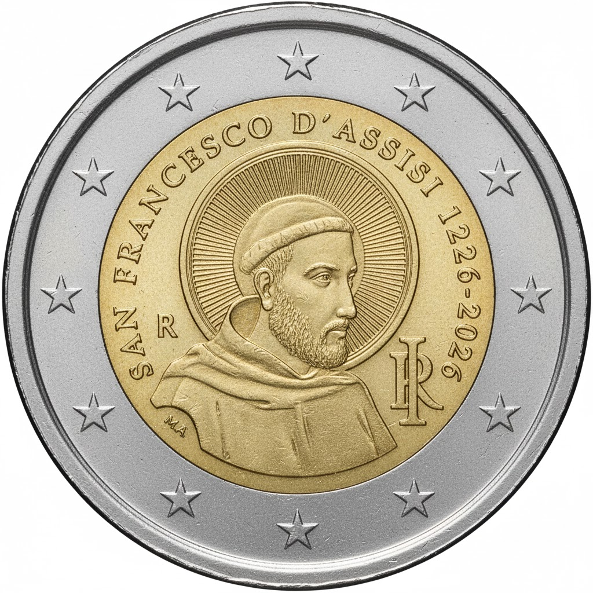

# Italy € 2.00

## Images

## Metadata

**Country:** [Italy](../../Countries/Italy/index.md)\
**Monetary value:** € 2.00\
**Currency:** Euro\
**Issue date:** 2026-04-01\
**Designer:** Antonio Vecchio

## Description

800th anniversary of the death of Saint Francis of Assisi

## Mintages

| Year | Mintmark | Circulated | Brilliant Uncirculated | Proof |
| ---- | -------- | ---------- | ---------------------- | ----- |
| 2026 |          | 0          | 262000                 | 19500 |

### Sources

- Mintages BU [1, (rolls)](https://www.shop.ipzs.it/en/2-sfrancesco-fdc-rotol-comm248-2ms10-26f0009.html), [2 (coincard)](https://www.shop.ipzs.it/en/2-sfrancesco-fdc-coin-comm248-2ms10-26f0008.html)
- Mintages [Proof](https://www.shop.ipzs.it/en/2-sfrancesco-proof-comm248-2ms10-26p0006.html), [Reverse Proof](https://www.shop.ipzs.it/en/2-sfrancesco-rev-proof-comm248-2ms10-26p0007.html), [Proof and Reverse Proof in year set)](https://www.shop.ipzs.it/en/serie-12pz48-2ms10-26p0024.html)
- [Issue Date](https://www.shop.ipzs.it/en/2-sfrancesco-fdc-coin-comm248-2ms10-26f0008.html)
- [Designer](https://www.shop.ipzs.it/en/2-sfrancesco-fdc-rotol-comm248-2ms10-26f0009.html)
