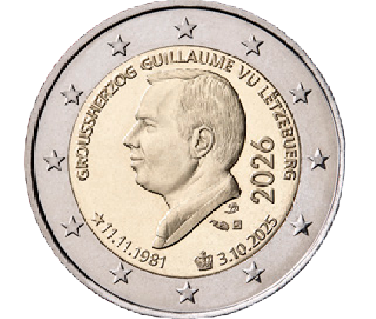

# Luxembourg € 2.00

## Images

## Metadata

**Country:** [Luxembourg](../../Countries/Luxembourg/index.md)\
**Monetary value:** € 2.00\
**Currency:** Euro\
**Issue date:** 2026-07-13\
**Designer:** Helmut Andexlinger

## Description

Accession to the Throne of Grand Duke William and Commemoration of his 45th birthday

## Mintages

| Year | Mintmark | Circulated | Brilliant Uncirculated | Proof |
| ---- | -------- | ---------- | ---------------------- | ----- |
| 2026 |          | 120000     | 7500                   | 0     |

### Sources

- [Mintages](https://eshop.bcl.lu/T/product_page/m/25/id_prod/25_26.html)
- [Designer](https://today.rtl.lu/news/luxembourg/luxembourg-unveils-new-coins-featuring-grand-duke-guillaume-1863471379)
- [Issue Date](https://eshop.bcl.lu/T/product_page/m/25/id_prod/25_26.html)
