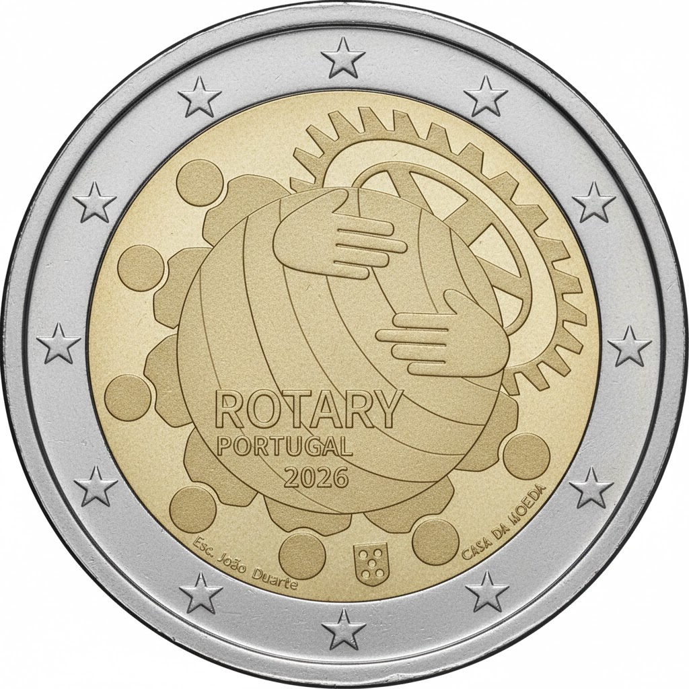

# Portugal € 2.00

## Images

## Metadata

**Country:** [Portugal](../../Countries/Portugal/index.md)\
**Monetary value:** € 2.00\
**Currency:** Euro\
**Issue date:** 2026-07-15\
**Designer:** João Duarte

## Description

100 Years of the Rotary in Portugal

## Mintages

| Year | Mintmark | Circulated | Brilliant Uncirculated | Proof |
| ---- | -------- | ---------- | ---------------------- | ----- |
| 2026 |          | 500000     | 7500                   | 7500  |

### Sources

- [Issue Date](https://www.bportugal.pt/page/plano-de-moedas-comemorativas-com-acabamento-normal-emitir-em-portugal-2026)
