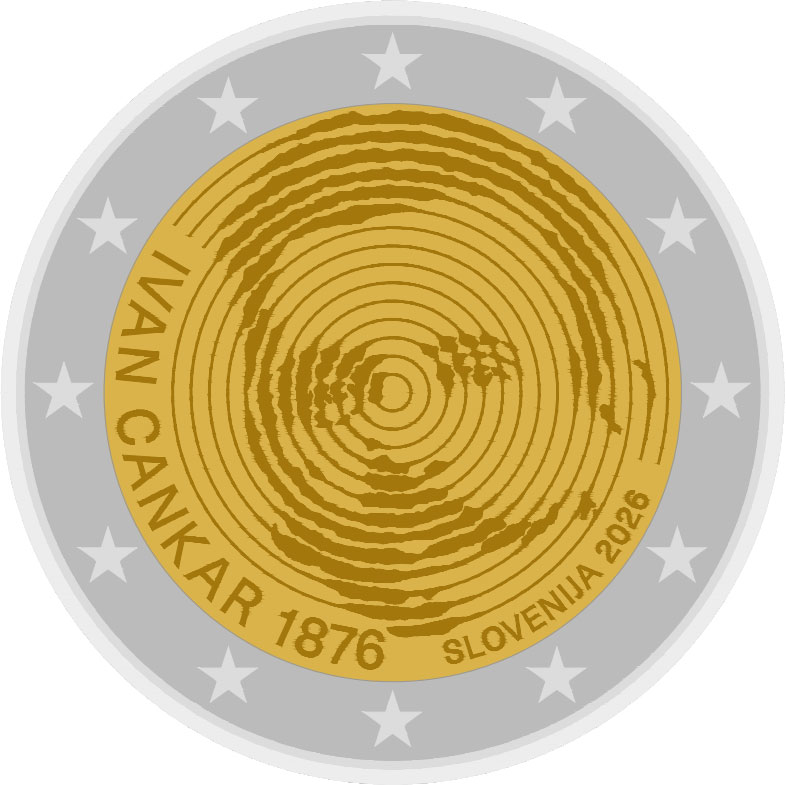

# Slovenia € 2.00

## Images

## Metadata

**Country:** [Slovenia](../../Countries/Slovenia/index.md)\
**Monetary value:** € 2.00\
**Currency:** Euro\
**Issue date:** 2026-06-17\
**Designer:** Adam Breznik

## Description

150th Anniversary of the birth of Ivan Cankar

## Mintages

| Year | Mintmark | Circulated | Brilliant Uncirculated | Proof |
| ---- | -------- | ---------- | ---------------------- | ----- |
| 2026 |          | 991000     | 0                      | 3000  |

[Design](https://www.bsi.si/sl/gotovina/numizmatika/150-obletnica-rojstva-ivana-cankarja-2026)\
[Issue date](https://www.bsi.si/sl/mediji/objave/numizmaticni-izdelki-za-leto-2026-v-prodajo-17-junija)\
[Designer](https://www.bsi.si/sl/gotovina/numizmatika/150-obletnica-rojstva-ivana-cankarja-2026)\
[Mintages Circulated](https://www.bsi.si/sl/gotovina/numizmatika/150-obletnica-rojstva-ivana-cankarja-2026)