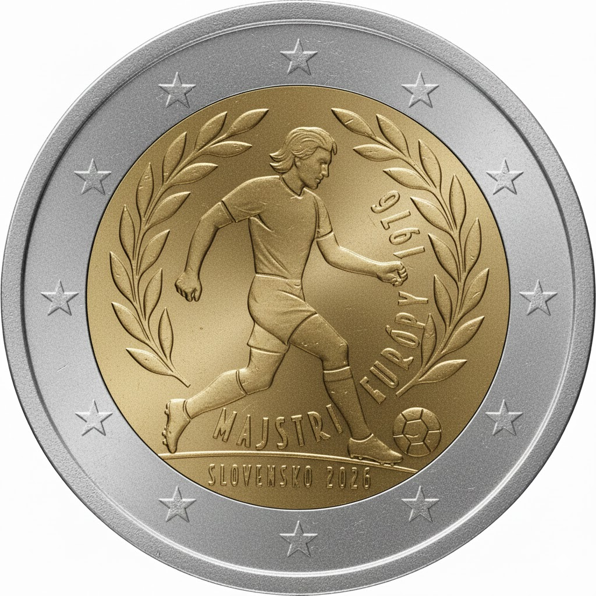

# Slovakia € 2.00

## Images

## Metadata

**Country:** [Slovakia](../../Countries/Slovakia/index.md)\
**Monetary value:** € 2.00\
**Currency:** Euro\
**Issue date:** 2026-06-15\
**Designer:** Matěj Hanuš

## Description

50th Anniversary of Czechoslovakia’s victory in the European Football Championship

## Mintages

| Year | Mintmark | Circulated | Brilliant Uncirculated | Proof |
| ---- | -------- | ---------- | ---------------------- | ----- |
| 2026 |          | 995000     | 5000                   | 0     |

[Designer](https://nbs.sk/en/news/statement-from-the-nbs-bank-boards-7th-meeting-of-2026/)