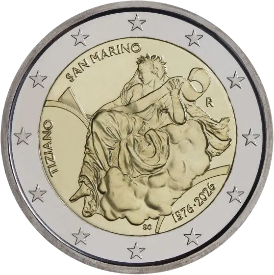

# San Marino € 2.00

## Images

## Metadata

**Country:** [San Marino](../../Countries/San%20Marino/index.md)\
**Monetary value:** € 2.00\
**Currency:** Euro\
**Issue date:** 2026-03-31\
**Designer:** Silvia Ciuccii

## Description

450th Anniversary of the death of Titian

## Mintages

| Year | Mintmark | Circulated | Brilliant Uncirculated | Proof |
| ---- | -------- | ---------- | ---------------------- | ----- |
| 2026 |          | 0          | 52000                  | 4000  |

### Sources

- [Mintages BU](https://www.dfn.sm/en/2-euro-450-anniversario-della-scomparsa-di-tiziano.html)
- [Mintages Proof](https://www.dfn.sm/en/2-euro-proof-450-anniversario-della-scomparsa-di-tiziano.html)
- [Release Date](https://www.dfn.sm/en/2-euro-450-anniversario-della-scomparsa-di-tiziano.html)
- [Designer](https://www.dfn.sm/en/2-euro-450-anniversario-della-scomparsa-di-tiziano.html)
