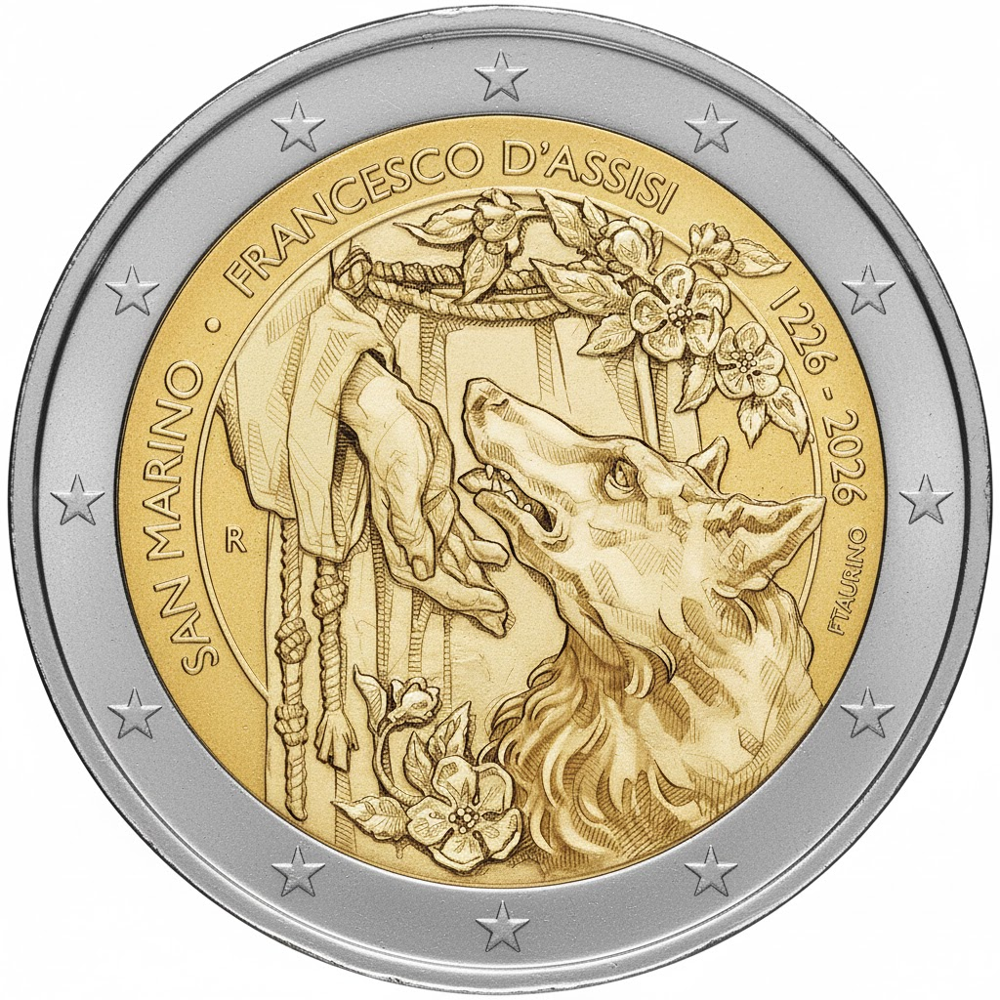

# San Marino € 2.00

## Images

## Metadata

**Country:** [San Marino](../../Countries/San%20Marino/index.md)\
**Monetary value:** € 2.00\
**Currency:** Euro\
**Issue date:** 

## Description

800th Anniversary of the Death of Francis of Assisi

## Mintages

| Year | Mintmark | Circulated | Brilliant Uncirculated | Proof |
| ---- | -------- | ---------- | ---------------------- | ----- |
| 2026 |          | 0          | 56000                  | 0     |
