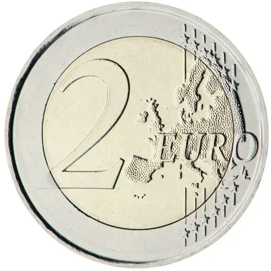
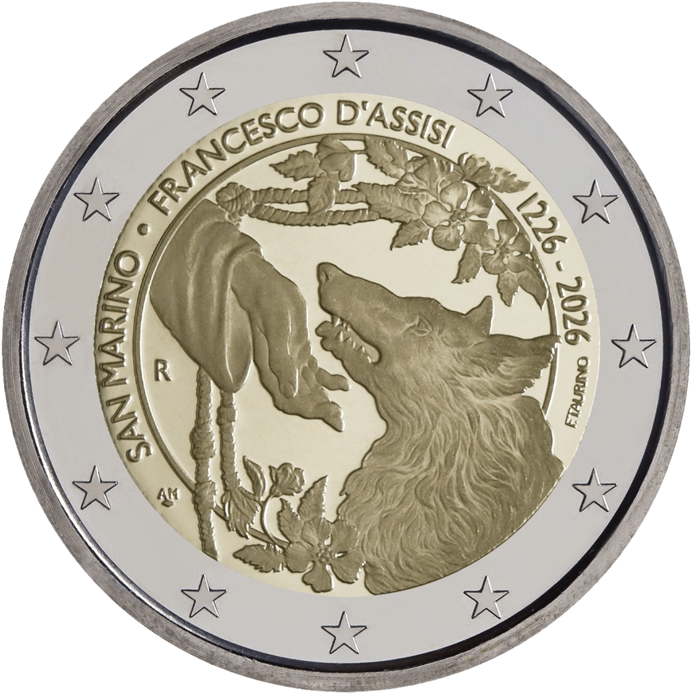

# San Marino € 2.00

## Images

## Metadata

**Country:** [San Marino](../../Countries/San%20Marino/index.md)\
**Monetary value:** € 2.00\
**Currency:** Euro\
**Issue date:** 2026-10-06\
**Designer:** Fani Ivanka Taurino

## Description

800th Anniversary of the Death of Francis of Assisi

## Mintages

| Year | Mintmark | Circulated | Brilliant Uncirculated | Proof |
| ---- | -------- | ---------- | ---------------------- | ----- |
| 2026 |          | 500        | 51500                  | 8000  |

### Sources

- Mintages [BU](https://www.dfn.sm/2-euro-800-anniversario-della-scomparsa-di-francesco-d-assisi.html)
- Mintages [Proof](https://www.dfn.sm/2-euro-proof-800-ann-scomparsa-di-francesco-d-assisi.html), [Reverse Proof](https://www.dfn.sm/2-euro-reverse-proof-800-ann-scomparsa-di-francesco-d-assisi.html)
- [Issue date](https://www.poste.sm/in-commemoration-of-the-800th-anniversary-of-the-death-of-francis-of-assisi-poste-san-marino-is-issuing-a-set-of-commemorative-two-euro-coins-in-bu-proof-and-reverse-proof-versions/)
- [Designer](https://zwei-euro.com/en/news/2-euro-commemorative-coin-san-marino-2026-franz-von-assisi/)
