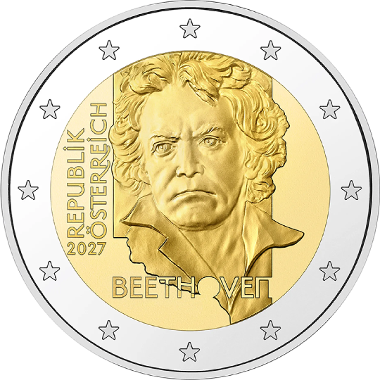

# Austria € 2.00

## Images

## Metadata

**Country:** [Austria](../../Countries/Austria/index.md)\
**Monetary value:** € 2.00\
**Currency:** Euro\
**Issue date:** 2026-12-02\
**Designer:** 

## Description

200th anniversary of Ludwig von Beethoven's death

## Mintages

| Year | Mintmark | Circulated | Brilliant Uncirculated | Proof |
| ---- | -------- | ---------- | ---------------------- | ----- |
| 2027 |          | 0          | 0                      | 7500  |

[Mintage Proof](https://www.muenzeoesterreich.at/sammeln/euro-muenzen/2-euro-muenzen)
[Design](https://www.muenzeoesterreich.at/sammeln/euro-muenzen/2-euro-muenzen)
[Issue Date](https://www.muenzeoesterreich.at/sammeln/euro-muenzen/2-euro-muenzen)