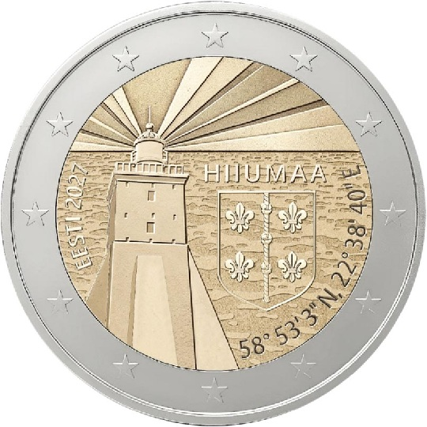

# Estonia € 2.00

## Images

## Metadata

**Country:** [Estonia](../../Countries/Estonia/index.md)\
**Monetary value:** € 2.00\
**Currency:** Euro\
**Issue date:** 2027\
**Designer:** Kaupo Kangro

## Description

Hiiumaa, first coin in the Counties of Estonia series. The design centres on the Kõpu lighthouse against a background of sea waves, with the rays of light mirroring the striped patterns of the Hiiumaa national costume skirt.

## Mintages

| Year | Mintmark | Circulated | Brilliant Uncirculated | Proof |
| ---- | -------- | ---------- | ---------------------- | ----- |
| 2027 |          | 1000000    | 0                      | 0     |

### Sources

- [Design](https://www.eestipank.ee/en/press/two-euro-coin-hiiumaa-will-show-kopu-lighthouse-13082026)
- [Designer](https://www.eestipank.ee/en/press/two-euro-coin-hiiumaa-will-show-kopu-lighthouse-13082026)
- [Mintages Circulated](https://www.eestipank.ee/en/press/two-euro-coin-hiiumaa-will-show-kopu-lighthouse-13082026)
