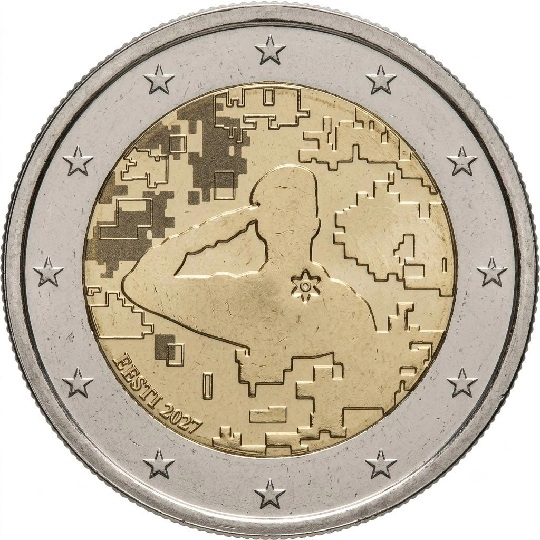

# Estonia € 2.00

## Images

## Metadata

**Country:** [Estonia](../../Countries/Estonia/index.md)\
**Monetary value:** € 2.00\
**Currency:** Euro\
**Issue date:** 2027\
**Designer:** Kerli Tamjärv

## Description

Veterans of the Estonian Defence Forces, third coin in the Resistance series. A silhouette of a saluting soldier with the veterans' flower (Sinilill) on the chest against a pixelated camouflage background.

## Mintages

| Year | Mintmark | Circulated | Brilliant Uncirculated | Proof |
| ---- | -------- | ---------- | ---------------------- | ----- |
| 2027 |          | 1000000    | 0                      | 0     |

### Sources

[Design](https://www.eestipank.ee/en/press/eesti-pank-approved-design-two-euro-commemorative-coin-dedicated-veterans-estonian-defence-forces-06072026)\
[Designer](https://www.eestipank.ee/en/press/eesti-pank-approved-design-two-euro-commemorative-coin-dedicated-veterans-estonian-defence-forces-06072026)\
[Mintages Circulated](https://www.eestipank.ee/en/press/eesti-pank-approved-design-two-euro-commemorative-coin-dedicated-veterans-estonian-defence-forces-06072026)
