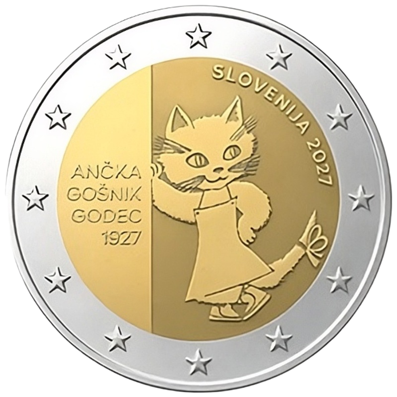

# Slovenia € 2.00

## Images

## Metadata

**Country:** [Slovenia](../../Countries/Slovenia/index.md)\
**Monetary value:** € 2.00\
**Currency:** Euro\
**Issue date:** 2027\
**Designer:** Tomaž Podboj, Daniela Vidmar Podboj

## Description

100th anniversary of the birth of illustrator Ančka Gošnik Godec

## Mintages

| Year | Mintmark | Circulated | Brilliant Uncirculated | Proof |
| ---- | -------- | ---------- | ---------------------- | ----- |
| 2027 |          | 0          | 0                      | 0     |

### Sources

- [Design](https://www.bsi.si/storage/uploads/a5c7df49-98c4-40bb-abac-c3be0e4261f1/Projekt-1---MCXAGG7.pdf)
- [Designer](https://www.bsi.si/en/media/posts/results-of-tender-for-designing-drafts-of-occasional-coins-to-be-issued-in-20276)
