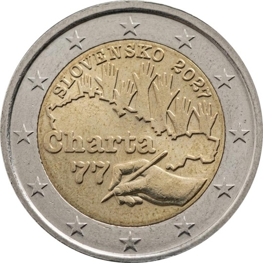

# Slovakia € 2.00

## Images

## Metadata

**Country:** [Slovakia](../../Countries/Slovakia/index.md)\
**Monetary value:** € 2.00\
**Currency:** Euro\
**Issue date:** 2027-01\
**Designer:** Karol Ličko

## Description

50th anniversary of the publication of Charter 77. A hand signing the Charter against the outline of former Czechoslovakia, with the hands of a jubilant crowd above.

## Mintages

| Year | Mintmark | Circulated | Brilliant Uncirculated | Proof |
| ---- | -------- | ---------- | ---------------------- | ----- |
| 2027 |          | 995000     | 0                      | 5000  |

### Sources

- [Design](https://nbs.sk/bankovky-a-mince/eurove-mince/aktuality/vysledky-sutazi/vysledky-verejnej-anonymnej-sutaze-na-vytvarny-navrh-narodnej-strany-pamatnej-euromince-v-nominalnej-hodnote-2-eura-k-50-vyrociu-zverejnenia-charty-77/)
- [Designer](https://zwei-euro.com/en/news/design-of-slovakia-s-first-2-euro-commemorative-coin-2027-50th/)
- [Issue date](https://nbs.sk/en/banknotes-and-coins/euro-coins/issue-plan/)
- [Mintages Circulated](https://www.2euros.org/en/2-euro-commemorative-slovakia/2027-slovakia-50th-anniversary-of-charter-77/)
- [Mintages Proof](https://www.2euros.org/en/2-euro-commemorative-slovakia/2027-slovakia-50th-anniversary-of-charter-77/)
