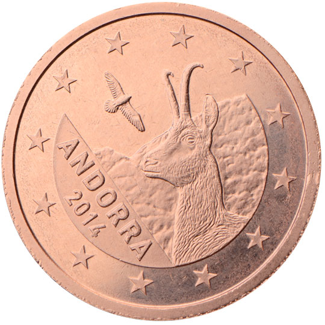

# Andorra € 0.02

## Images

## Metadata

**Country:** [Andorra](../index.md)\
**Serie:** [Andorra 2014 - ...](index.md)\
**Monetary value:** € 0.02\
**Currency:** Euro\
**Designer:** Ruben Da Silva Carpio

## Description

Pyrenean chamois and bird of prey

## Mintages

| Year | Mintmark | Circulated | Brilliant Uncirculated | Proof |
| ---- | -------- | ---------- | ---------------------- | ----- |
| 2014 |          | 200000     | 70000                  | 3000  |
| 2015 |          | 0          | 40000                  | 0     |
| 2016 |          | 0          | 35000                  | 0     |
| 2017 |          | 1515000    | 22000                  | 0     |
| 2018 |          | 2550000    | 20000                  | 0     |
| 2019 |          | 1727000    | 15000                  | 0     |
| 2020 |          | 0          | 12000                  | 0     |
| 2021 |          | 700000     | 10500                  | 0     |
| 2022 |          | 450000     | 10000                  | 0     |
| 2023 |          | 0          | 10500                  | 0     |
| 2024 |          | 900300     | 7000                   | 0     |
| 2025 |          | 0          | 7000                   | 0     |
| 2026 |          | 0          | 0                      | 0     |
