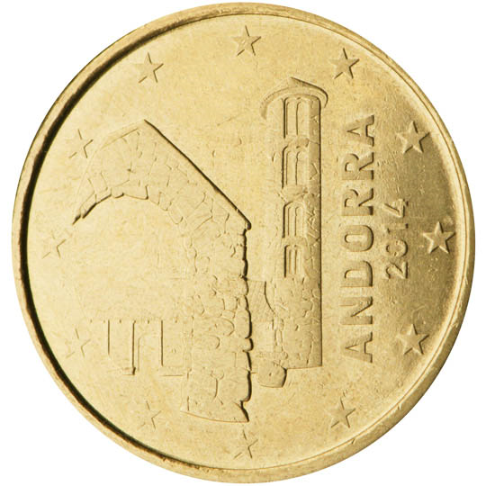

# Andorra € 0.10

## Images

 

## Metadata

**Country:** [Andorra](../index.md)\
**Serie:** [Andorra 2014 - ...](index.md)\
**Monetary value:** € 0.10\
**Currency:** Euro

## Description

## Mintages

| Year | Mintmark | Circulated | Brilliant Uncirculated | Proof |
| ---- | -------- | ---------- | ---------------------- | ----- |
| 2014 |  | 930000| 70000 | 3000 |
| 2015 |  | 0| 40000 |  |
| 2016 |  | 0| 35000 |  |
| 2017 |  | 1081000| 22000 |  |
| 2018 |  | 960000| 20000 |  |
| 2019 |  | 1595000| 15000 |  |
| 2020 |  | 840000| 20000 |  |
