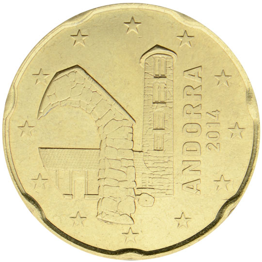

# Andorra € 0.20

## Images

## Metadata

**Country:** [Andorra](../index.md)\
**Serie:** [Andorra 2014 - ...](index.md)\
**Monetary value:** € 0.20\
**Currency:** Euro\
**Designer:** Pere Moles Sans

## Description

Church of Santa Colomael

## Mintages

| Year | Mintmark | Circulated | Brilliant Uncirculated | Proof |
| ---- | -------- | ---------- | ---------------------- | ----- |
| 2014 |          | 1000000    | 70000                  | 3000  |
| 2015 |          | 0          | 40000                  | 0     |
| 2016 |          | 0          | 35000                  | 0     |
| 2017 |          | 1213000    | 22000                  | 0     |
| 2018 |          | 1014000    | 20000                  | 0     |
| 2019 |          | 1570000    | 15000                  | 0     |
| 2020 |          | 175000     | 12000                  | 0     |
| 2021 |          | 1400000    | 10500                  | 0     |
| 2022 |          | 700000     | 10000                  | 0     |
| 2023 |          | 0          | 10500                  | 0     |
| 2024 |          | 0          | 7000                   | 0     |
| 2025 |          | 0          | 0                      | 0     |
