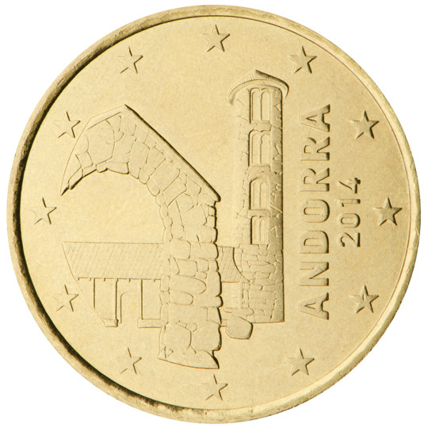

# Andorra € 0.50

## Images

## Metadata

**Country:** [Andorra](../index.md)\
**Serie:** [Andorra 2014 - ...](index.md)\
**Monetary value:** € 0.50\
**Currency:** Euro

## Description

## Mintages

| Year | Mintmark | Circulated | Brilliant Uncirculated | Proof |
| ---- | -------- | ---------- | ---------------------- | ----- |
| 2014 |          | 430000     | 70000                  | 3000  |
| 2015 |          | 0          | 40000                  |       |
| 2016 |          | 0          | 35000                  |       |
| 2017 |          | 946800     | 22000                  |       |
| 2018 |          | 870000     | 20000                  |       |
| 2019 |          | 915000     | 15000                  |       |
| 2020 |          | 720000     | 20000                  |       |
| 2021 |          | 0          | 0                      | 0     |
| 2022 |          | 0          | 0                      | 0     |
| 2023 |          | 0          | 0                      | 0     |
| 2024 |          | 0          | 0                      | 0     |
