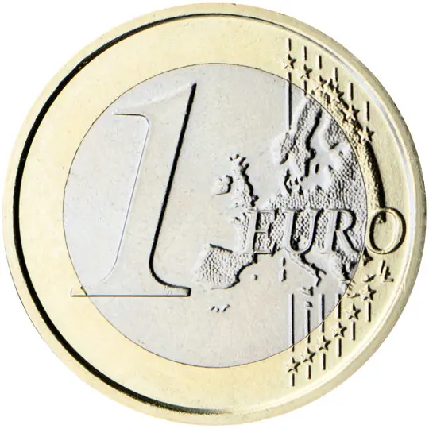
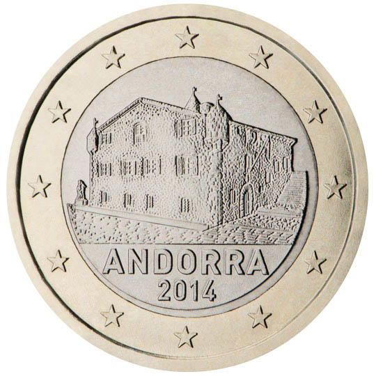

# Andorra € 1.00

## Images

## Metadata

**Country:** [Andorra](../index.md)\
**Serie:** [Andorra 2014 - ...](index.md)\
**Monetary value:** € 1.00\
**Currency:** Euro

## Description

Casa de la Vall

## Mintages

| Year | Mintmark | Circulated | Brilliant Uncirculated | Proof |
| ---- | -------- | ---------- | ---------------------- | ----- |
| 2014 |          | 651842     | 70000                  | 3000  |
| 2015 |          | 0          | 40000                  | 0     |
| 2016 |          | 2374200    | 35000                  | 0     |
| 2017 |          | 0          | 22000                  | 0     |
| 2018 |          | 0          | 20000                  | 0     |
| 2019 |          | 0          | 15000                  | 0     |
| 2020 |          | 0          | 12000                  | 0     |
| 2021 |          | 60500      | 10500                  | 0     |
| 2022 |          | 0          | 10000                  | 0     |
| 2023 |          | 0          | 10500                  | 0     |
| 2024 |          | 0          | 0                      | 0     |
