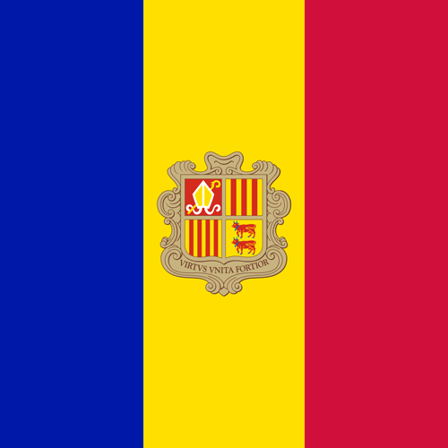

# Andorra

## Metadata

**Isocode:** AD

## Description

Andorra is a tiny, independent state in southwestern Europe. The country is located in the Pyrenees between France and Spain. Andorra has the euro since 2014.

## Images

