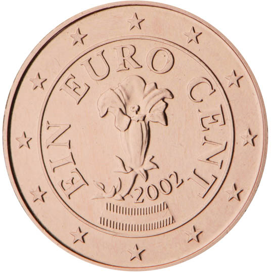

# Austria € 0.01

## Images

 

## Metadata

**Country:** [Austria](../index.md)\
**Serie:** [Austria 2002 - ...](index.md)\
**Monetary value:** € 0.02\
**Currency:** Euro\
**Denomination:** [1 eurocent](../../Denominations/2-eurocent.md)

An Alpine gentian as a symbol of Austria's part in developing EU environmental policy.
