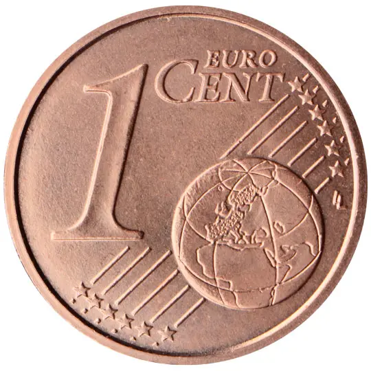
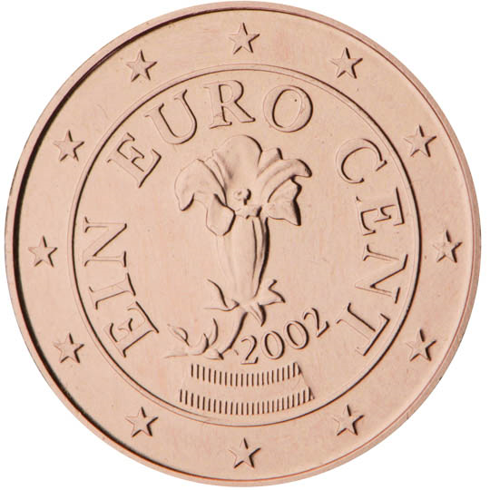

# Austria € 0.01

## Images

## Metadata

**Country:** [Austria](../index.md)\
**Serie:** [Austria 2002 - ...](index.md)\
**Monetary value:** € 0.01\
**Currency:** Euro

## Description

Gentian

## Mintages

| Year | Mintmark | Circulated | Brilliant Uncirculated | Proof |
| ---- | -------- | ---------- | ---------------------- | ----- |
| 2002 |          | 378400000  | 100000                 | 10000 |
| 2003 |          | 10800000   | 125000                 | 25000 |
| 2004 |          | 115000000  | 100000                 | 20000 |
| 2005 |          | 174700000  | 100000                 | 20000 |
| 2006 |          | 48300000   | 100000                 | 20000 |
| 2007 |          | 111900000  | 75000                  | 20000 |
| 2008 |          | 50900000   | 50000                  | 15000 |
| 2009 |          | 158900000  | 75000                  | 15000 |
| 2010 |          | 168500000  | 50000                  | 15000 |
| 2011 |          | 189600000  | 50000                  | 15000 |
| 2012 |          | 169300000  | 50000                  | 10000 |
| 2013 |          | 179200000  | 50000                  | 10000 |
| 2014 |          | 185500000  | 50000                  | 10000 |
| 2015 |          | 118000000  | 50000                  | 10000 |
| 2016 |          | 0          | 50000                  | 10000 |
| 2017 |          | 37700000   | 50000                  | 10000 |
| 2018 |          | 138500000  | 50000                  | 10000 |
| 2019 |          | 130900000  | 50000                  | 10000 |
| 2020 |          | 85500000   | 50000                  | 10000 |
| 2021 |          | 73400000   | 50000                  | 10000 |
| 2022 |          | 0          | 50000                  | 10000 |
| 2023 |          | 0          | 50000                  | 10000 |
| 2024 |          | 0          | 0                      | 0     |
