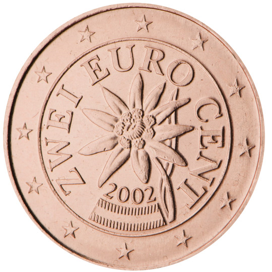

# Austria € 0.02

## Images

 

## Metadata

**Country:** [Austria](../index.md)\
**Serie:** [Austria 2002 - ...](index.md)\
**Monetary value:** € 0.01\
**Currency:** Euro\
**Denomination:** [1 eurocent](../../Denominations/1-eurocent.md)

## Description

An Alpine edelweiss as a symbol of Austria's part in developing EU environmental policy.

## Mintages

| Id  | Year | Circulated | Brilliant Uncirculated | Proof |
| --- | ---- | ---------- | ---------------------- | ----- |
|     | 2002 | 326400000  | 100000                 | 10000 |
|     | 2003 | 118500000  | 125000                 | 25000 |
|     | 2004 | 156400000  | 100000                 | 20000 |
|     | 2005 | 163200000  | 100000                 | 20000 |
|     | 2006 | 39800000   | 100000                 | 20000 |
|     | 2007 | 72200000   | 75000                  | 20000 |
|     | 2008 | 125100000  | 50000                  | 15000 |
|     | 2009 | 120400000  | 75000                  | 15000 |
|     | 2010 | 104200000  | 50000                  | 0     |
|     | 2011 | 148600000  | 50000                  | 15000 |
|     | 2012 | 78100000   | 50000                  | 10000 |
|     | 2013 | 121500000  | 50000                  | 10000 |
|     | 2014 | 116100000  | 50000                  | 10000 |
|     | 2015 | 45400000   | 50000                  | 10000 |
|     | 2016 | 0          | 50000                  | 10000 |
|     | 2017 | 57200000   | 50000                  | 10000 |
|     | 2018 | 85650000   | 50000                  | 10000 |
|     | 2019 | 91200000   | 50000                  | 10000 |
|     | 2020 | 0          | 50000                  | 10000 |
