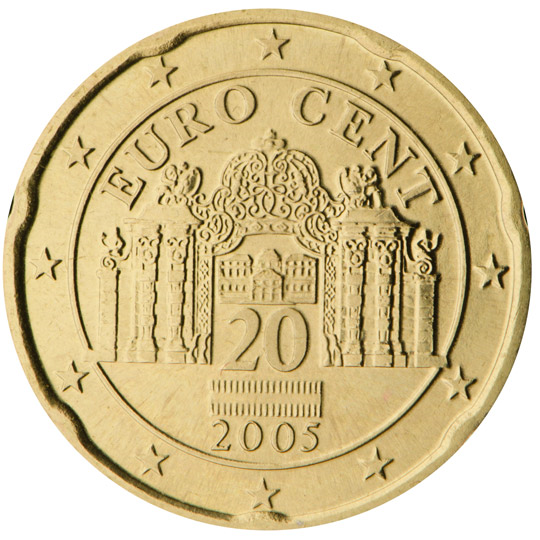

# Austria € 0.20

## Images

 

## Metadata

**Country:** [Austria](../index.md)\
**Serie:** [Austria 2002 - ...](index.md)\
**Monetary value:** € 0.20\
**Currency:** Euro\
**Denomination:** [20 eurocent](../../Denominations/20-eurocent.md)

## Description

## Mintages

| Id                        | Year | Circulated | Brilliant Uncirculated | Proof |
| ------------------------- | ---- | ---------- | ---------------------- | ----- |
| cm0tjc88700030cju90e39hq1 | 2002 | 203400000  | 100000                 | 10000 |
