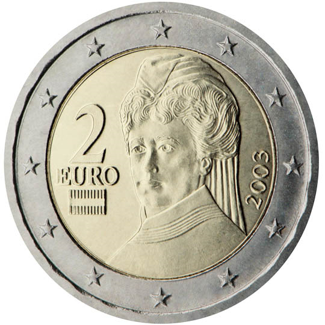

# Austria € 2.00

## Images

## Metadata

**Country:** [Austria](../index.md)\
**Serie:** [Austria 2002 - ...](index.md)\
**Monetary value:** € 2.00\
**Currency:** Euro\
**Designer:** Josef Kaiser

## Description

Bertha von Suttner

## Mintages

| Year | Mintmark | Circulated | Brilliant Uncirculated | Proof |
| ---- | -------- | ---------- | ---------------------- | ----- |
| 2002 |          | 196400000  | 100000                 | 10000 |
| 2003 |          | 4700000    | 125000                 | 25000 |
| 2004 |          | 2500000    | 100000                 | 20000 |
| 2005 |          | 0          | 100000                 | 20000 |
| 2006 |          | 2300000    | 100000                 | 20000 |
| 2007 |          | 0          | 75000                  | 20000 |
| 2008 |          | 2600000    | 50000                  | 15000 |
| 2009 |          | 0          | 75000                  | 15000 |
| 2010 |          | 17000000   | 50000                  | 15000 |
| 2011 |          | 27700000   | 50000                  | 15000 |
| 2012 |          | 21200000   | 50000                  | 10000 |
| 2013 |          | 10100000   | 50000                  | 10000 |
| 2014 |          | 20100000   | 50000                  | 10000 |
| 2015 |          | 12300000   | 50000                  | 10000 |
| 2016 |          | 0          | 50000                  | 10000 |
| 2017 |          | 17700000   | 50000                  | 10000 |
| 2018 |          | 0          | 50000                  | 10000 |
| 2019 |          | 15800000   | 50000                  | 10000 |
| 2020 |          | 9900000    | 50000                  | 10000 |
| 2021 |          | 9100000    | 50000                  | 10000 |
| 2022 |          | 9100000    | 50000                  | 10000 |
| 2023 |          | 38300000   | 50000                  | 10000 |
| 2024 |          | 25500000   | 50000                  | 10000 |
| 2025 |          | 0          | 100000                 | 0     |
| 2026 |          | 0          | 0                      | 0     |
