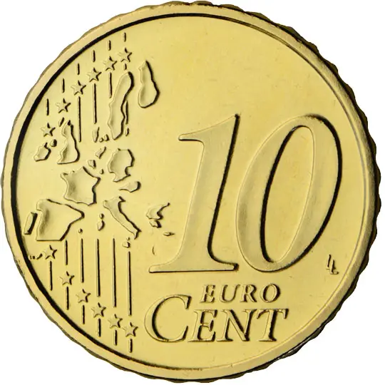
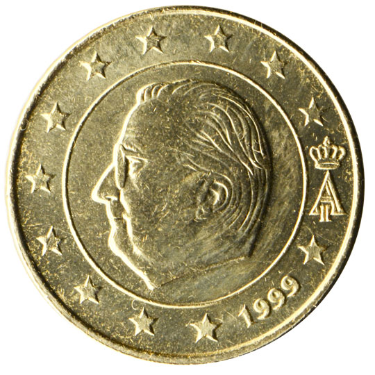

# Belgium € 0.10

## Images

## Metadata

**Country:** [Belgium](../index.md)\
**Serie:** [Belgium 1999 - 2014](index.md)\
**Monetary value:** € 0.10\
**Currency:** Euro

## Description

## Mintages

| Year | Mintmark | Circulated | Brilliant Uncirculated | Proof |
| ---- | -------- | ---------- | ---------------------- | ----- |
| 1999 |          | 180950000  | 40000                  | 10388 |
| 2000 |          | 0          | 40000                  | 10388 |
| 2001 |          | 145750000  | 40000                  | 10388 |
| 2002 |          | 0          | 140000                 | 7866  |
| 2003 |          | 0          | 185000                 | 7866  |
| 2004 |          | 20000000   | 85250                  | 3006  |
| 2005 |          | 10000000   | 53100                  | 3006  |
| 2006 |          | 0          | 43018                  | 3006  |
| 2007 |          | 0          | 53475                  | 2006  |
| 2008 |          | 0          | 39500                  | 2006  |
| 2009 |          | 0          | 39500                  | 1506  |
| 2010 |          | 25000000   | 42000                  | 1850  |
| 2011 |          | 25000000   | 22300                  | 1850  |
| 2012 |          | 25000000   | 32000                  | 1000  |
| 2013 |          | 5000000    | 24600                  | 1000  |
