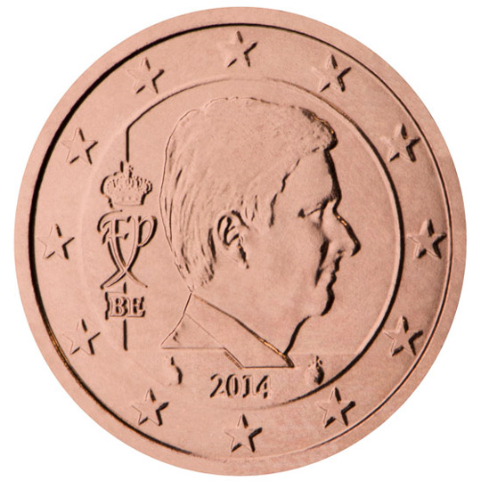

# Belgium € 0.01

## Images

## Metadata

**Country:** [Belgium](../index.md)\
**Serie:** [Belgium 2014 - ...](index.md)\
**Monetary value:** € 0.01\
**Currency:** Euro

## Description

## Mintages

| Year | Mintmark | Circulated | Brilliant Uncirculated | Proof |
| ---- | -------- | ---------- | ---------------------- | ----- |
| 2014 |  | 0| 78000 | 1500 |
| 2015 |  | 14870000| 43000 | 1000 |
| 2016 |  | 29750000| 45000 | 1000 |
| 2017 |  | 1575000| 27500 | 1000 |
| 2018 |  | 0| 47000 | 750 |
| 2019 |  | 0| 27000 | 1500 |
| 2020 |  | 0| 20500 | 1000 |
| 2021 |  | 0 | 0 | 0 |
| 2022 |  | 0 | 0 | 0 |
| 2023 |  | 0 | 0 | 0 |
| 2024 |  | 0 | 0 | 0 |
