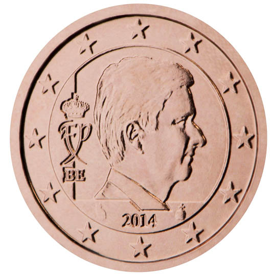

# Belgium € 0.05

## Images

## Metadata

**Country:** [Belgium](../index.md)\
**Serie:** [Belgium 2014 - ...](index.md)\
**Monetary value:** € 0.05\
**Currency:** Euro\
**Designer:** Luc Luycx

## Description

Profile picture of King Philippe of Belgium and royal monogram

## Mintages

| Year | Mintmark | Circulated | Brilliant Uncirculated | Proof |
| ---- | -------- | ---------- | ---------------------- | ----- |
| 2014 |          | 14500000   | 78000                  | 1500  |
| 2015 |          | 10000000   | 43000                  | 1000  |
| 2016 |          | 19900000   | 45000                  | 1000  |
| 2017 |          | 48444500   | 27500                  | 1000  |
| 2018 |          | 5300000    | 47000                  | 750   |
| 2019 |          | 10000000   | 27000                  | 1500  |
| 2020 |          | 0          | 20500                  | 1000  |
| 2021 |          | 0          | 14250                  | 0     |
| 2022 |          | 0          | 13500                  | 0     |
| 2023 |          | 0          | 21000                  | 0     |
| 2024 |          | 0          | 13500                  | 0     |
| 2025 |          | 0          | 0                      | 0     |
| 2026 |          | 0          | 0                      | 0     |
