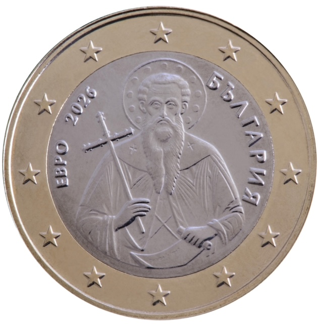

# Bulgaria € 1.00

## Images

## Metadata

**Country:** [Bulgaria](../index.md)\
**Serie:** [Bulgaria 2026 - ...](index.md)\
**Monetary value:** € 1.00\
**Currency:** Euro

## Description

St. Ivan Rilski

## Mintages

| Year | Mintmark | Circulated | Brilliant Uncirculated | Proof |
| ---- | -------- | ---------- | ---------------------- | ----- |
| 2026 |          | 0          | 0                      | 0     |
