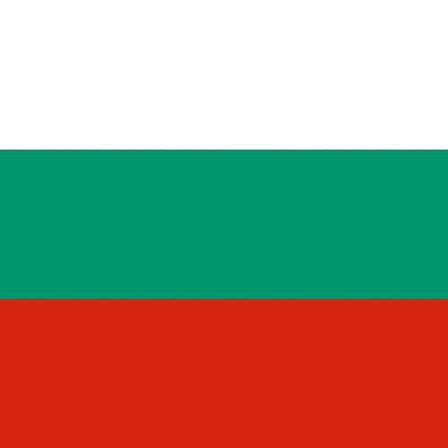

# Bulgaria

## Metadata

**Isocode:** BG

## Description

Bulgaria is a country in Central and Southeast Europe, on the coast of the Black Sea. On 1 January 2026 Bulgaria adopted the euro and became the 21th member of the euro area.

## Images

