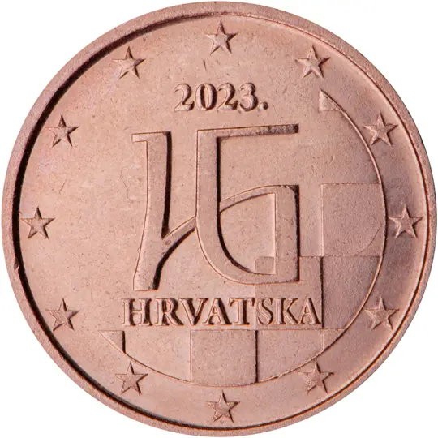

# Croatia € 0.02

## Images

## Metadata

**Country:** [Croatia](../index.md)\
**Serie:** [Croatia 2023 - ...](index.md)\
**Monetary value:** € 0.02\
**Currency:** Euro

## Description

HR Ligature

## Mintages

| Year | Mintmark | Circulated | Brilliant Uncirculated | Proof |
| ---- | -------- | ---------- | ---------------------- | ----- |
| 2023 |          | 63000000   | 30000                  | 0     |
| 2024 |          | 0          | 0                      | 0     |
