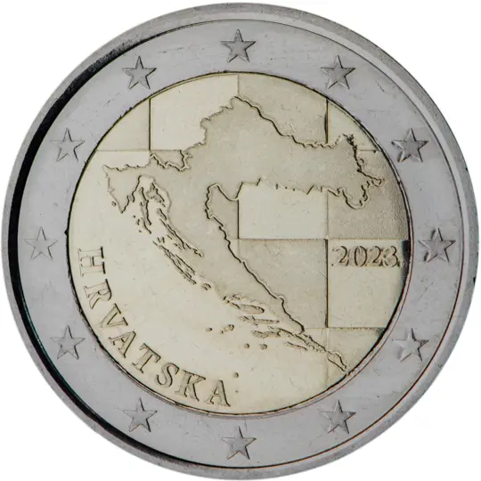

# Croatia € 2.00

## Images

## Metadata

**Country:** [Croatia](../index.md)\
**Serie:** [Croatia 2023 - ...](index.md)\
**Monetary value:** € 2.00\
**Currency:** Euro\
**Designer:** Ivan Šivak

## Description

Outline Croatia

## Mintages

| Year | Mintmark | Circulated | Brilliant Uncirculated | Proof |
| ---- | -------- | ---------- | ---------------------- | ----- |
| 2023 |          | 30000000   | 500                    | 7500  |
| 2024 |          | 0          | 500                    | 30000 |
| 2025 |          | 0          | 0                      | 0     |
| 2026 |          | 0          | 0                      | 0     |
