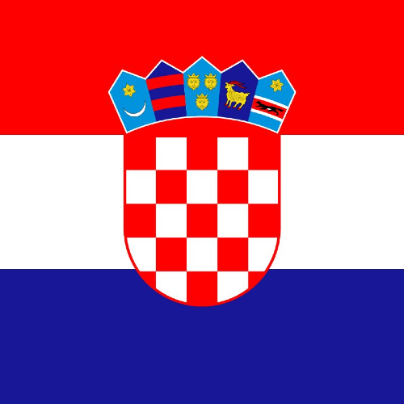

# Croatia

## Metadata

**Isocode:** HR

## Description

Croatia is a country in Central and Southeast Europe, on the coast of the Adriatic Sea. On 1 January 2023 Croatia adopted the euro and became the 20th member of the euro area.

## Images

