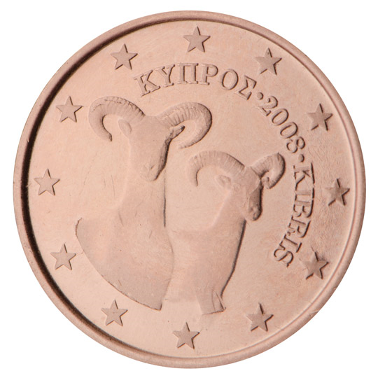

# Cyprus € 0.01

## Images

## Metadata

**Country:** [Cyprus](../index.md)\
**Serie:** [Cyprus 2008 - ...](index.md)\
**Monetary value:** € 0.01\
**Currency:** Euro

## Description

Mouflons

## Mintages

| Year | Mintmark | Circulated | Brilliant Uncirculated | Proof |
| ---- | -------- | ---------- | ---------------------- | ----- |
| 2008 |          | 40000000   | 70000                  | 0     |
| 2009 |          | 20000000   | 15000                  | 0     |
| 2010 |          | 200000     | 0                      | 0     |
| 2011 |          | 15210000   | 10000                  | 0     |
| 2012 |          | 210000     | 12000                  | 0     |
| 2013 |          | 100000     | 10000                  | 0     |
| 2014 |          | 100000     | 7000                   | 0     |
| 2015 |          | 7100000    | 7000                   | 0     |
| 2016 |          | 8007000    | 7000                   | 0     |
| 2017 |          | 100000     | 5000                   | 0     |
| 2018 |          | 18100000   | 5000                   | 0     |
| 2019 |          | 11100000   | 5000                   | 0     |
| 2020 |          | 8005000    | 5000                   | 0     |
| 2021 |          | 9155000    | 5000                   | 0     |
| 2022 |          | 9905000    | 5000                   | 0     |
| 2023 |          | 0          | 5000                   | 0     |
| 2024 |          | 0          | 5000                   | 0     |
| 2025 |          | 0          | 0                      | 0     |
